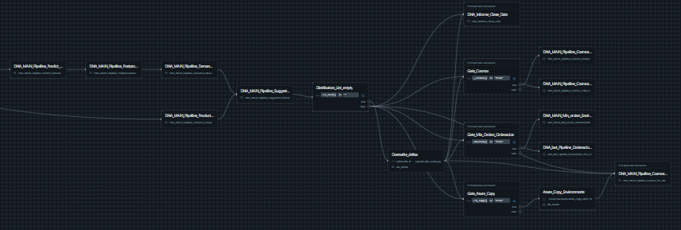

# The Problem
You need to grant permissions to your colleague in a Databricks Workflow.
This Workflow is full of nested Workflows. 
It looks like this:


You have to click on each workflow and grant permissions on each
of the nested Workflows.

# The solution
`java -jar dbgremlin.jar give-job-permissions --user-email "your-colleague@email.com" --job-id 1234567897`

A single command recursively sets permissions on each of the nested Workflows.

By default, it sets `CAN_MANAGE` permissions. But you can set a different level using the
`--permission-level` option:
`java -jar dbgremlin.jar give-job-permissions --permission-level CAN_VIEW --user-email "your-colleague@email.com" --job-id 1234567897`

You cannot grant `IS_OWNER` level by design. You should not be granting those permissions willy nilly.

## Listing dependent workflows
If you just want to see which workflows depend on a given workflow, run:
`java -jar dbgremlin.jar list-dependent --job-id 1234567897`

## Where to find the jar
The `jar` is available on the [actions artifacts](https://github.com/JoaquinIglesiasTurina/dbgremlin/actions).
Click on any successful run, and you can download the jar there.

# Prerequisites
You need to have [Databricks CLI configured](https://learn.microsoft.com/en-us/azure/databricks/dev-tools/cli/tutorial)
Make sure that the Workspace you want to grant premissions in is set as default. In your `.databrickscfg` file:
```
[DEFAULT]
host  = https://adb-<your-workspace-id>.10.azuredatabricks.net
token = dapp<your-personal-access-token>-2
```
Yout can check that `databricks jobs list` contains the Workflow you want to grant permissions on. If so, the Databricks CLI is configured correctly.

You also need `java`.

## Limitations
Tested on Azure Databricks only.